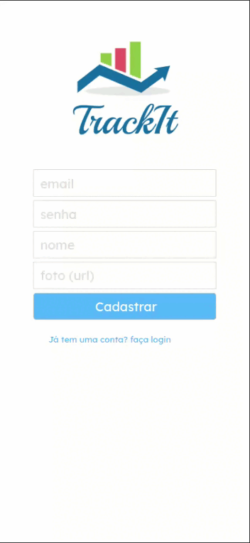

# Tracklit

<p align="center">
   
</p>


- Esta é uma aplicação web onde você pode gerenciar os seus hábitos
- Você pode criar um hábido, selecionar quais dias você os quer praticar e visualizar quais hábitos você tem que praticar no dia de hoje

- [Veja meu deploy na Vercel aqui](https://)

***

# Demonstração

<p align="center">
   
</p>

## Como usar

Instale meu projeto e suas dependências

```bash
  git clone git@github.com:marcojr73/projeto10-trackit.git
  
  npm i
  
  npm start
```

***

##	 Tecnologias e Conceitos

- HTML
- CSS
- React
- Persistência de login com local storage
- Styled components
- Context API
- React-progress-bar
- react-loader-spinner

***
    
